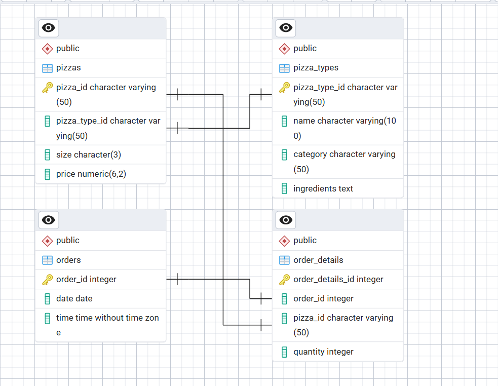
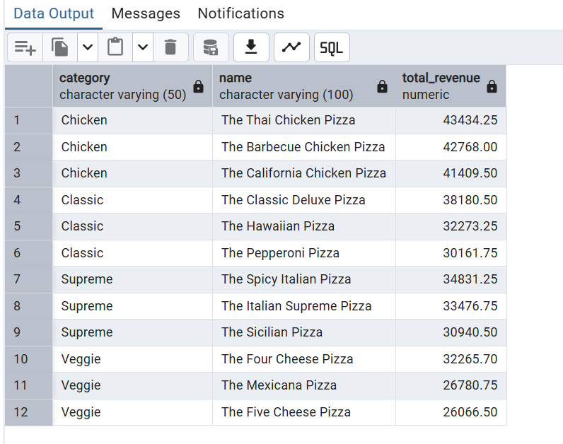

# 🍕 Pizza Sales SQL Analysis  

This project demonstrates my ability to perform **end-to-end SQL data analysis** on real-world sales data.  
Using **PostgreSQL**, I designed the database schema, imported raw CSV files, and wrote queries to answer **business-driven questions** ranging from simple sales reporting to advanced insights using **CTEs, subqueries, and window functions**.  

The analysis highlights not just technical SQL skills but also the ability to extract **actionable business insights** — the kind of analysis companies use to understand sales performance, customer behavior, and revenue drivers.  


---

## 📂 Project Structure  

- **`create_table_query.txt`** → SQL schema for creating tables  
- **`Pizza_sales_csv.zip`** → Dataset (Orders, Order Details, Pizzas, Pizza Types)  
- **`Questions.txt`** → 30+ SQL questions (Basic → Advanced)  
- **`Answer.sql`** → My SQL solutions with business insights  
- **`images`** → Sample Output & Schema Diagram Screenshot images 

---

## 🗂️ Database Schema  

The database is designed with four tables: **pizzas, pizza_types, orders, and order_details**.  
This schema ensures normalized relationships between orders, pizzas, and pizza categories.  

  
*Figure: Entity-Relationship (ER) diagram of the Pizza Sales database schema*

---

## 🛠️ Tech Stack
- PostgreSQL  
- SQL  
- CSV (raw dataset)  
- GitHub for version control  
- Data Analysis & Business Insights  
- Markdown (Documentation)  

---

## 🛠️ Skills & SQL Techniques  

- ✔️ Data Cleaning & Schema Design
- ✔️ Joins (INNER, LEFT)
- ✔️ Aggregations (SUM, COUNT, AVG, GROUP BY, HAVING)
- ✔️ Date & Time Functions (sales by hour, day, month)
- ✔️ Subqueries & Nested Queries
- ✔️ Common Table Expressions (CTEs)
- ✔️ Window Functions (RANK, ROW_NUMBER, DENSE_RANK)

---

## 📊 Key Business Insights  

- 🕑 **Peak Sales Hours** → Highest orders between **12 PM – 1 PM** (lunch time)  
- 🍕 **Top-Selling Pizzas** → *Classic Deluxe* and *Hawaiian* lead sales volume  
- 💰 **Revenue Contribution** → **Large-size pizzas** generate the most revenue  
- 📈 **Monthly Trends** → Sales peak on **weekends and month-end**  
- 👥 **Customer Patterns** → Some customers repeatedly placed **10+ orders**  

---

## 🚀 How to Reproduce  

1. Run **`create_table_query.txt`** to create the database schema  
2. Import CSVs from **`Pizza_sales_csv.zip`** into PostgreSQL  
3. Solve questions from **`Questions.txt`**  
4. Compare results with **`Answer.sql`**  

---

## 🏆 What I Achieved  
- Built a **sales analytics project** from raw transactional data  
- Extracted **business insights** that could help optimize sales & strategy  
- Demonstrated **SQL expertise** in schema design, joins, aggregations, CTEs & window functions  
- Practiced **real-world analytics** similar to what companies expect from data analysts  


---

## 📸 Sample Output  
  
*Figure: Top 3 pizzas in each Category by revenue contribution*

#### Query
```sql 
--4.Identify the top 3 pizza types contributing the most to revenue in each category.
WITH ranked_pizzas AS (
	SELECT pt.category, pt.name,
	SUM(p.price * od.quantity) AS total_revenue,
	ROW_NUMBER() OVER (PARTITION BY pt.category 
		ORDER BY SUM(p.price * od.quantity) DESC) AS rank_within_category
	FROM order_details od
	JOIN pizzas p ON od.pizza_id = p.pizza_id
	JOIN pizza_types pt ON p.pizza_type_id = pt.pizza_type_id
	GROUP BY pt.category, pt.name
)
SELECT rp.category, rp.name, rp.total_revenue
FROM ranked_pizzas rp
WHERE rp.rank_within_category <= 3;
```

---

## 📧 Contact

🔗 [LinkedIn – Harsh Belekar](https://www.linkedin.com/in/harshbelekar)